# Use Case Diagram: SmartBin System

## Diagram

```mermaid
graph TB
    subgraph Actors
        User[System User]
        Student[Student]
        FacilitiesAdmin[Facilities Admin]
        SustainabilityOfficer[Sustainability Officer]
        ITAdmin[IT Administrator]
        FinanceOffice[Finance Office]
        DiningServices[Dining Services]
    end

    %% Generalization - Student is a type of System User
    User --> Student

    subgraph SmartBin System
        Register[Register Account]
        Login[Login / Authenticate]
        ScanBin[Scan Bin QR Code]
        DepositItem[Deposit Recyclable Item]
        ViewPoints[View Points Balance]
        ViewHistory[View Transaction History]
        ViewLeaderboard[View Leaderboard]
        RedeemReward[Redeem Reward]
        ViewRewardCatalog[View Reward Catalog]
        MonitorBins[Monitor Bin Fill Levels]
        ReceiveAlerts[Receive Fill-Level Alerts]
        ManageRewards[Manage Reward Catalog]
        ViewAnalytics[View Recycling Analytics]
        GenerateReports[Generate Sustainability Reports]
        ManageBudget[Manage Reward Budget]
        VerifyVoucher[Verify Redemption Voucher]
    end

    Student --> Register
    Student --> Login
    Student --> ScanBin
    Student --> DepositItem
    Student --> ViewPoints
    Student --> ViewHistory
    Student --> ViewLeaderboard
    Student --> RedeemReward
    Student --> ViewRewardCatalog

    FacilitiesAdmin --> MonitorBins
    FacilitiesAdmin --> ReceiveAlerts

    SustainabilityOfficer --> ViewAnalytics
    SustainabilityOfficer --> GenerateReports

    ITAdmin --> MonitorBins
    ITAdmin --> ReceiveAlerts

    FinanceOffice --> ManageBudget
    FinanceOffice --> GenerateReports

    DiningServices --> ManageRewards
    DiningServices --> VerifyVoucher

    %% Include relationships
    RedeemReward -.-> |<<includes>>| ViewRewardCatalog
    RedeemReward -.-> |<<includes>>| ViewPoints
    DepositItem -.-> |<<includes>>| ViewPoints
    ScanBin -.-> |<<includes>>| Login
    GenerateReports -.-> |<<includes>>| ViewAnalytics
    VerifyVoucher -.-> |<<includes>>| ViewPoints
```

## Actors and Their Roles

| Actor | Role in System |
|-------|----------------|
| **System User** | Abstract actor representing any authenticated user. |
| **Student** | Primary user who recycles items, earns points, and redeems rewards. |
| **Facilities Admin** | Monitors bin fill levels and responds to alerts for bin emptying. |
| **Sustainability Officer** | Analyzes recycling data and generates reports for university leadership. |
| **IT Administrator** | Manages system infrastructure, monitors performance, and ensures security. |
| **Finance Office** | Oversees reward budget, prevents fraud, and tracks program costs. |
| **Dining Services** | Manages reward catalog and verifies voucher redemptions. |

## Generalization Explanation

**Student** is a specialization of **System User**, meaning all use cases available to System User are available to Student. This models that students share common behaviors (login, view profile) while having their own specific behaviors (deposit items, redeem rewards).

Other actors (Facilities Admin, Sustainability Officer, IT Administrator, Finance Office, Dining Services) are independent because they have distinct responsibilities not shared with other actor types.

## Key Use Cases

| Use Case | Description |
|----------|-------------|
| Register Account | Student creates account with university email |
| Login / Authenticate | Student authenticates via email/password or QR code |
| Scan Bin QR Code | Student scans bin to identify themselves |
| Deposit Recyclable Item | Student deposits item, system awards points |
| View Points Balance | Student checks current point total |
| View Transaction History | Student sees history of earned and redeemed points |
| View Leaderboard | Student sees top recyclers |
| View Reward Catalog | Student browses available rewards |
| Redeem Reward | Student exchanges points for a reward |
| Monitor Bin Fill Levels | Admin views real-time bin status |
| Receive Fill-Level Alerts | Admin gets notifications for full bins |
| Manage Reward Catalog | Admin adds/edits/removes rewards |
| View Recycling Analytics | Officer sees recycling trends and metrics |
| Generate Sustainability Reports | Officer exports reports for stakeholders |
| Manage Reward Budget | Finance tracks and controls reward spending |
| Verify Redemption Voucher | Dining Services validates QR code vouchers |

## Relationships Explained

### Generalization
- **Student** generalizes **System User** - students share common authentication and profile behaviors with other user types that may be added in the future.

### Include Relationships
- **Redeem Reward** includes **View Reward Catalog** - students must browse rewards before selecting one
- **Redeem Reward** includes **View Points** - system checks points before allowing redemption
- **Deposit Item** includes **View Points** - students see points awarded after deposit
- **Scan Bin** includes **Login** - scanning a bin automatically authenticates the student
- **Generate Reports** includes **View Analytics** - reports are built from analytics data
- **Verify Voucher** includes **View Points** - dining services can see points deducted for redemption

## How This Diagram Addresses Stakeholder Concerns

The use cases directly map to stakeholder concerns identified in Assignment 4:

| Stakeholder | Concern | Addressed By |
|-------------|---------|--------------|
| Student | Easy point tracking | View Points Balance, View History |
| Student | Fair rewards | View Reward Catalog, Redeem Reward |
| Facilities Admin | Overflow prevention | Monitor Bins, Receive Alerts |
| Sustainability Officer | Accurate recycling data | View Analytics, Generate Reports |
| Finance Office | Budget control | Manage Budget, Verify Voucher |
| Dining Services | Voucher fraud prevention | Verify Voucher, Manage Rewards |
