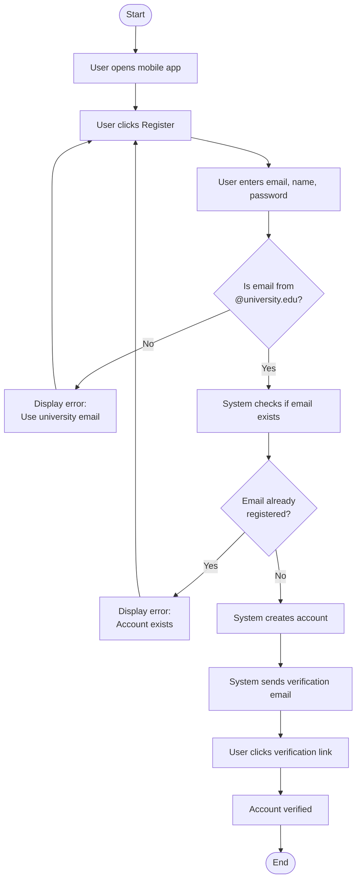

## Workflow 1: User Registration

### Diagram

### Explanation

| Element | Description |
|---------|-------------|
| **Start Node** | User opens mobile app |
| **End Node** | Account verified |
| **Actions** | Enter details, validate email, check existence, create account, send email, verify link |
| **Decisions** | Valid email domain? Email already registered? |
| **Parallel Actions** | None in this workflow |
| **Swimlanes** | User: opens app, clicks Register, enters details, clicks verification link; System: validates email, checks existence, creates account, sends email |

### Traceability

**Functional Requirements:**
- FR1 (User Registration) → Full workflow

**Use Cases:**
- UC-001 (Register Account) → Complete use case mapped

**User Stories:**
- US-001 (Register for account) → User story implemented

**Stakeholder Concerns Addressed:**
- Students need easy registration → Simple form with clear errors
- IT Admin needs security → Email domain validation ensures only university students register
