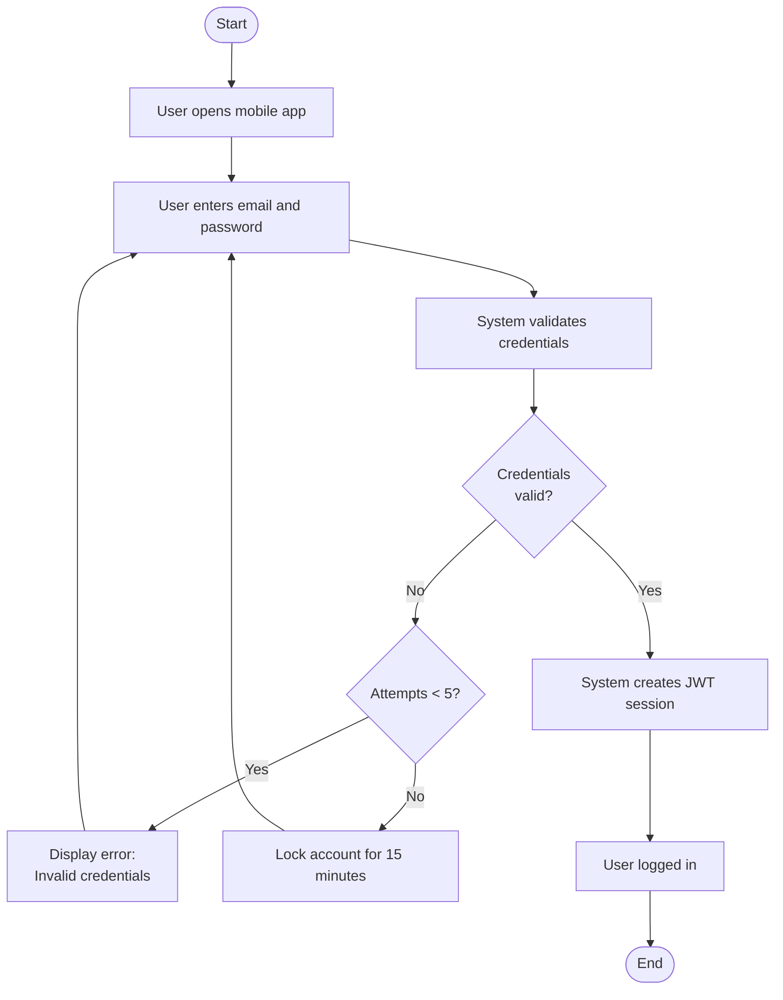
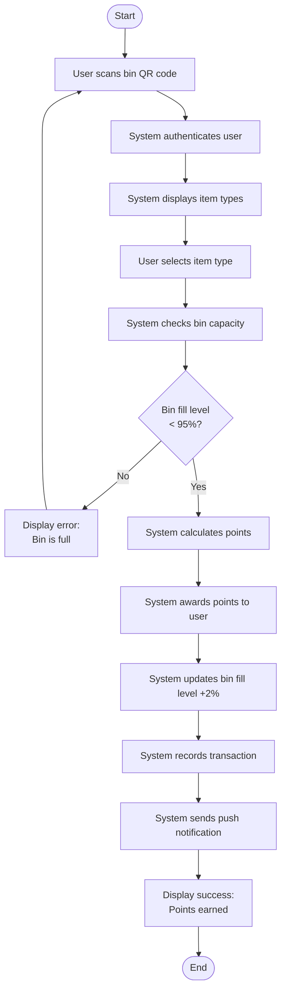
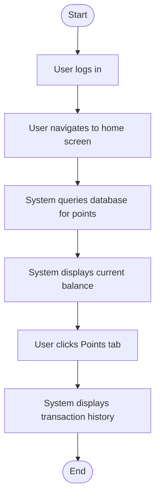
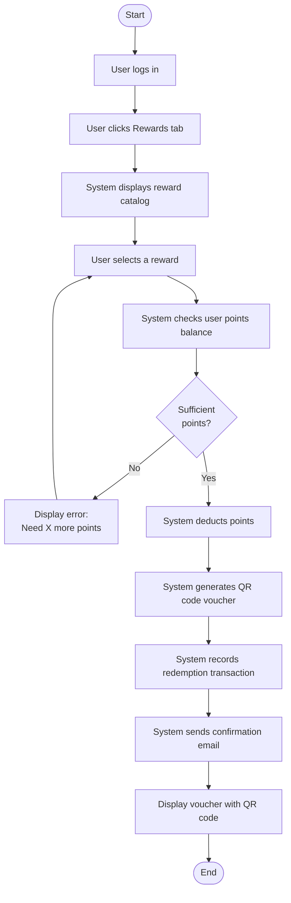
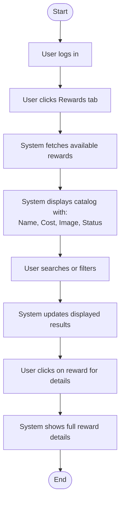
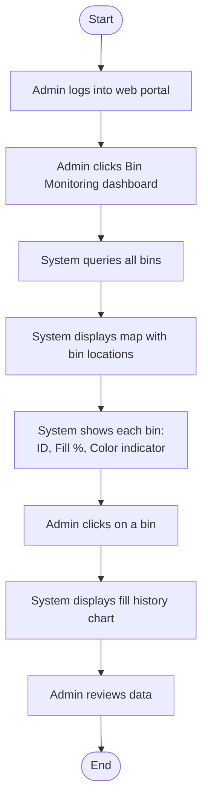
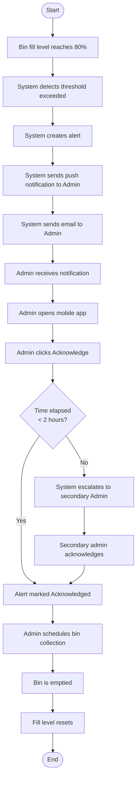

## Workflow 1: User Registration

### Diagram

### Explanation

| Element | Description |
|---------|-------------|
| **Start Node** | User opens mobile app |
| **End Node** | Account verified |
| **Actions** | Enter details, validate email, check existence, create account, send email, verify link |
| **Decisions** | Valid email domain? Email already registered? |
| **Parallel Actions** | None in this workflow |
| **Swimlanes** | User: opens app, clicks Register, enters details, clicks verification link; System: validates email, checks existence, creates account, sends email |

### Traceability

**Functional Requirements (Assignment 4):**
- FR1 (User Registration) → Full workflow

**Use Cases (Assignment 5):**
- UC-001 (Register Account) → Complete use case mapped

**User Stories (Assignment 6):**
- US-001 (Register for account) → User story implemented

**Sprint Tasks (Assignment 6):**
- T-001.1: Create database schema for users table
- T-001.2: Implement registration API endpoint
- T-001.3: Add email validation for university domain
- T-001.4: Implement email verification service
- T-001.5: Create registration UI screen
- T-001.6: Add form validation and error handling

**Stakeholder Concerns Addressed:**
- Students need easy registration → Simple form with clear errors
- IT Admin needs security → Email domain validation ensures only university students register

## Workflow 2: User Login / Authentication

### Diagram

### Explanation

| Element | Description |
|---------|-------------|
| **Start Node** | User opens mobile app |
| **End Node** | User logged in |
| **Actions** | Enter credentials, validate, track attempts, lock account, create session |
| **Decisions** | Credentials valid? Attempts less than 5? |
| **Parallel Actions** | None in this workflow |
| **Swimlanes** | User: opens app, enters credentials; System: validates, tracks attempts, locks account, creates session |

### Traceability

**Functional Requirements (Assignment 4):**
- FR2 (User Authentication) → Full workflow

**Use Cases (Assignment 5):**
- UC-002 (Login/Authenticate) → Complete use case mapped

**User Stories (Assignment 6):**
- US-002 (Log in to account) → User story implemented

**Sprint Tasks (Assignment 6):**
- T-002.1: Implement login API endpoint with JWT
- T-002.2: Add password hashing verification
- T-002.3: Implement session management
- T-002.4: Create login UI screen
- T-002.5: Add rate limiting for failed attempts

**Stakeholder Concerns Addressed:**
- Students want quick login → Success path is fast (<3 seconds)
- IT Admin needs security → Account lockout after 5 failed attempts

## Workflow 3: Deposit Recyclable Item

### Diagram

### Explanation

| Element | Description |
|---------|-------------|
| **Start Node** | User scans bin QR code |
| **End Node** | Success message displayed |
| **Actions** | Authenticate, select item, calculate points, award points, update bin, record transaction, send notification |
| **Decisions** | Bin fill level < 95%? |
| **Parallel Actions** | None in this workflow |
| **Swimlanes** | User: scans QR code, selects item type; System: authenticates, checks capacity, calculates points, updates bin, records transaction, sends notification |

### Traceability

**Functional Requirements (Assignment 4):**
- FR3 (Point Awarding) → Full workflow
- FR7 (Bin Fill-Level Monitoring) → Bin capacity check

**Use Cases (Assignment 5):**
- UC-003 (Deposit Recyclable Item) → Complete use case mapped

**User Stories (Assignment 6):**
- US-003 (Deposit item and earn points) → User story implemented

**Sprint Tasks (Assignment 6):**
- T-003.1: Create bin simulator script
- T-003.2: Implement QR code scanning in mobile app
- T-003.3: Create deposit API endpoint
- T-003.4: Implement points calculation logic
- T-003.5: Create transactions table and repository
- T-003.6: Add push notification service for points
- T-003.7: Create deposit confirmation UI

**Stakeholder Concerns Addressed:**
- Students want instant points → Points awarded immediately
- Facilities Admin needs accurate bin data → Fill level updated after each deposit

## Workflow 4: View Points Balance

### Diagram

### Explanation

| Element | Description |
|---------|-------------|
| **Start Node** | User logs in |
| **End Node** | Transaction history displayed |
| **Actions** | Navigate, query database, display balance, show history |
| **Decisions** | None (simple workflow) |
| **Parallel Actions** | None in this workflow |
| **Swimlanes** | User: logs in, navigates, clicks tabs; System: queries database, displays data |

### Traceability

**Functional Requirements (Assignment 4):**
- FR4 (Point Balance Viewing) → Full workflow

**Use Cases (Assignment 5):**
- UC-004 (View Points Balance) → Complete use case mapped

**User Stories (Assignment 6):**
- US-004 (View point balance) → Balance displayed
- US-005 (View transaction history) → History displayed

**Sprint Tasks (Assignment 6):**
- T-004.1: Create points balance API endpoint
- T-004.2: Display balance on home screen
- T-004.3: Add real-time balance update

**Stakeholder Concerns Addressed:**
- Students want to track points → Real-time balance and history visible
- Sustainability Officer needs engagement data → History shows participation

## Workflow 5: Redeem Reward

### Diagram

### Explanation

| Element | Description |
|---------|-------------|
| **Start Node** | User logs in |
| **End Node** | Voucher displayed |
| **Actions** | Browse catalog, select reward, check points, deduct points, generate QR code, record transaction, send email |
| **Decisions** | Sufficient points? |
| **Parallel Actions** | None in this workflow |
| **Swimlanes** | User: logs in, clicks Rewards, selects reward; System: displays catalog, checks points, deducts, generates QR code, records, sends email |

### Traceability

**Functional Requirements (Assignment 4):**
- FR6 (Reward Redemption) → Full workflow

**Use Cases (Assignment 5):**
- UC-005 (Redeem Reward) → Complete use case mapped

**User Stories (Assignment 6):**
- US-007 (Redeem points for rewards) → User story implemented

**Sprint Tasks (Assignment 6):**
- T-007.1: Create redemption API endpoint
- T-007.2: Implement points deduction logic
- T-007.3: Generate unique QR code vouchers
- T-007.4: Create redemption confirmation UI
- T-007.5: Add email confirmation service
- T-007.6: Implement voucher verification endpoint

**Stakeholder Concerns Addressed:**
- Students want fair redemption → Points deducted only if sufficient
- Finance needs fraud prevention → QR code generation with unique ID

## Workflow 6: View Reward Catalog

### Diagram

### Explanation

| Element | Description |
|---------|-------------|
| **Start Node** | User logs in |
| **End Node** | Reward details shown |
| **Actions** | Fetch rewards, display catalog, search/filter, show details |
| **Decisions** | None (simple workflow) |
| **Parallel Actions** | None in this workflow |
| **Swimlanes** | User: logs in, clicks Rewards, searches, clicks reward; System: fetches data, displays catalog, updates results, shows details |

### Traceability

**Functional Requirements (Assignment 4):**
- FR5 (Reward Catalog) → Full workflow

**Use Cases (Assignment 5):**
- UC-006 (View Reward Catalog) → Complete use case mapped

**User Stories (Assignment 6):**
- US-006 (Browse available rewards) → User story implemented

**Sprint Tasks (Assignment 6):**
- T-006.1: Create rewards table and schema
- T-006.2: Implement rewards catalog API endpoint
- T-006.3: Create rewards catalog UI screen
- T-006.4: Add search and filter functionality

**Stakeholder Concerns Addressed:**
- Students want to see options → Catalog shows all available rewards
- Dining Services needs inventory management → Status shows availability

## Workflow 7: Monitor Bin Fill Levels

### Diagram

### Explanation

| Element | Description |
|---------|-------------|
| **Start Node** | Admin logs into web portal |
| **End Node** | Admin reviews data |
| **Actions** | Query bins, display map, show fill levels, show history |
| **Decisions** | None (simple workflow) |
| **Parallel Actions** | None in this workflow |
| **Swimlanes** | Admin: logs in, clicks dashboard, clicks bin; System: queries bins, displays map, shows levels, shows history |

### Traceability

**Functional Requirements (Assignment 4):**
- FR7 (Bin Fill-Level Monitoring) → Full workflow

**Use Cases (Assignment 5):**
- UC-007 (Monitor Bin Fill Levels) → Complete use case mapped

**User Stories (Assignment 6):**
- US-009 (Monitor bin fill levels) → User story implemented

**Sprint Tasks (Assignment 6):**
- T-009.1: Create bins table and schema
- T-009.2: Implement bin data API endpoint
- T-009.3: Create bin simulator fill level updates
- T-009.4: Create admin dashboard map view
- T-009.5: Add color-coded bin status indicators

**Stakeholder Concerns Addressed:**
- Facilities Admin needs real-time data → Map with color-coded indicators
- Sustainability Officer needs trends → Fill history chart

## Workflow 8: Receive Fill-Level Alerts

### Diagram

### Explanation

| Element | Description |
|---------|-------------|
| **Start Node** | Bin fill level reaches 80% |
| **End Node** | Bin emptied and fill level resets |
| **Actions** | Detect, create alert, send push, send email, acknowledge, escalate, schedule collection, empty bin |
| **Decisions** | Time elapsed < 2 hours? |
| **Parallel Actions** | Push notification and email are sent in parallel |
| **Swimlanes** | Bin Simulator: sends fill level data; System: detects, creates alert, sends notifications, escalates; Admin: receives, acknowledges, schedules collection; Staff: empties bin |

### Traceability

**Functional Requirements (Assignment 4):**
- FR8 (Fill-Level Alerts) → Full workflow

**Use Cases (Assignment 5):**
- UC-008 (Receive Fill-Level Alerts) → Complete use case mapped

**User Stories (Assignment 6):**
- US-010 (Receive fill-level alerts) → User story implemented

**Sprint Tasks (Assignment 6):**
- T-009.2: Implement bin data API endpoint
- T-009.3: Create bin simulator fill level updates
- T-009.4: Create admin dashboard map view
- T-009.5: Add color-coded bin status indicators

**Stakeholder Concerns Addressed:**
- Facilities Admin needs proactive alerts → Immediate push/email notifications
- IT Admin needs reliability → Escalation if not acknowledged within 2 hours
