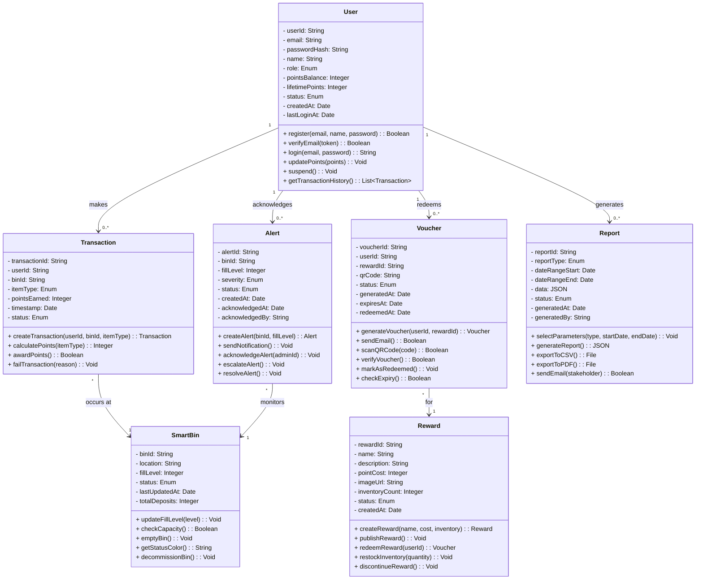

# Class Diagram - Assignment 9

## Overview

This document contains the UML class diagram for the SmartBin system using Mermaid.js syntax. The diagram includes 7 classes with their attributes, methods, relationships, and multiplicities.

---

## Class Diagram

## Key Design Decisions

| Decision | Rationale |
|----------|-----------|
| **No inheritance hierarchy** | The 7 entities have distinct behaviors and don't share enough common attributes to justify inheritance. |
| **User role as Enum** | Fixed set of roles (STUDENT, ADMIN, OFFICER, FINANCE, DINING) with distinct permissions. |
| **Transaction references userId and binId** | Uses string references instead of direct object references to avoid circular dependencies. |
| **Voucher has expiry logic** | `checkExpiry()` method encapsulates business rule that vouchers expire after 30 days. |
| **Alert has escalation logic** | `escalateAlert()` method implements business rule that unacknowledged alerts escalate after 2 hours. |

## Relationship Summary

| Relationship Type | Between Classes | Multiplicity |
|------------------|-----------------|--------------|
| Association | User → Transaction | 1 → 0..* |
| Association | User → Voucher | 1 → 0..* |
| Association | User → Alert | 1 → 0..* |
| Association | User → Report | 1 → 0..* |
| Association | Transaction → SmartBin | * ← 1 |
| Association | Voucher → Reward | * ← 1 |
| Association | Alert → SmartBin | * ← 1 |

## Multiplicity Key

| Symbol | Meaning |
|--------|---------|
| 1 | Exactly one |
| 0..1 | Zero or one |
| 0..* | Zero or more |
| 1..* | One or more |
| * | Many (zero or more) |

## Alignment with Previous Assignments

| Assignment | Alignment |
|------------|-----------|
| Assignment 4 (Functional Requirements) | Business rules map to FR1-FR14 |
| Assignment 5 (Use Cases) | Methods map to UC-001 through UC-008 |
| Assignment 6 (User Stories) | Classes support US-001 through US-015 |
| Assignment 8 (State Diagrams) | Status enums match state diagrams for each object |

## Notes

1. `List~Transaction~` is used instead of `List<Transaction>` because angle brackets cause parsing errors in Mermaid.
2. Enum types are represented in the diagram as attributes with "Enum" type.
3. ID references (`userId`, `binId`, `rewardId`) are used instead of object references to avoid circular dependencies.
