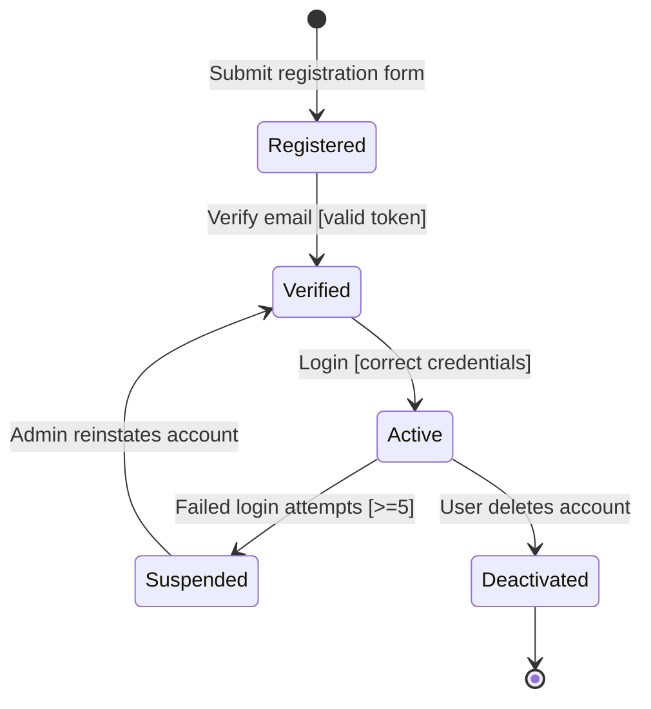

## Object 1: User Account

### Diagram

### Explanation

| Element              | Description                                                                                                     |
| -------------------- | --------------------------------------------------------------------------------------------------------------- |
| **States**           | Registered, Verified, Active, Suspended, Deactivated                                                            |
| **Transitions**      | Registration, email verification, login, suspension, account deletion                                           |
| **Events**           | Submit form, verify email, login attempt, admin action                                                          |
| **Guard Conditions** | Valid token required for verification; login only with correct credentials; suspension after ≥5 failed attempts |

### Traceability

**Functional Requirements:**

* FR1: User Registration → Registered state
* FR2: User Authentication → Active state
* FR2: Security → Suspended state

**User Stories:**

* US-001: Register account → Registered → Verified
* US-002: Login → Verified → Active

