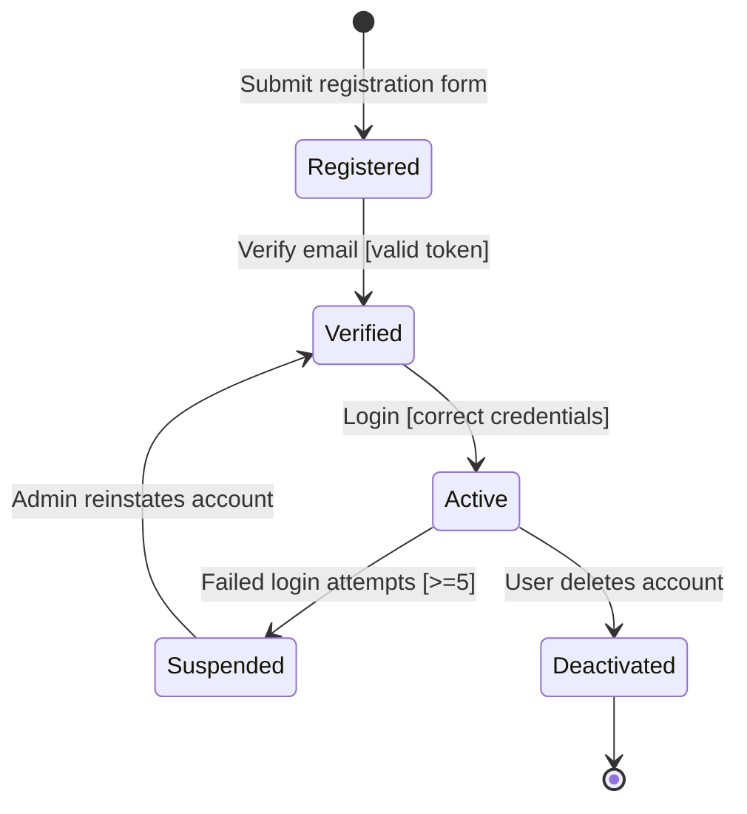
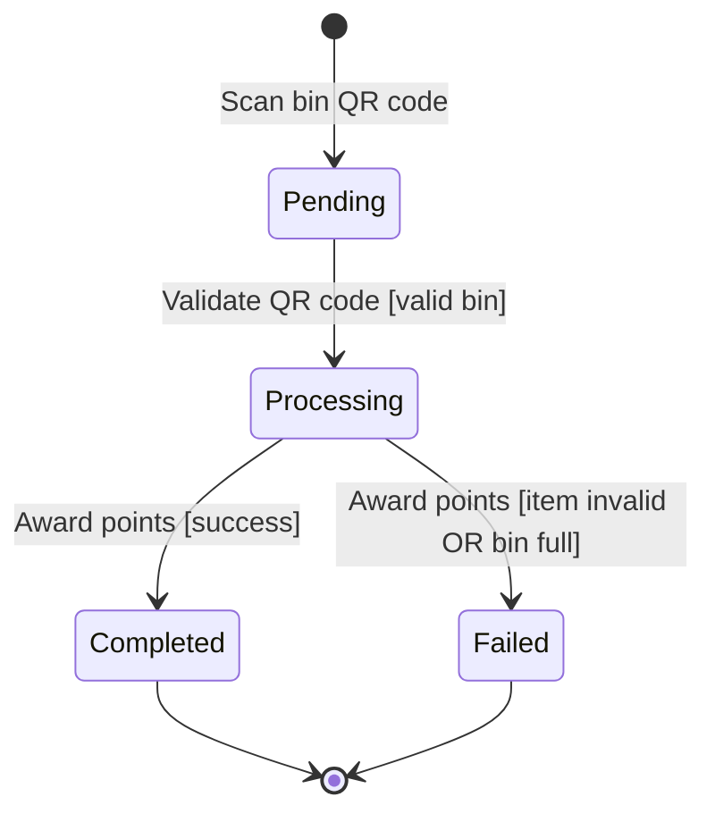
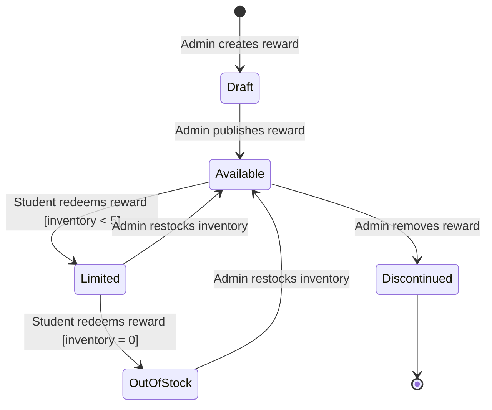
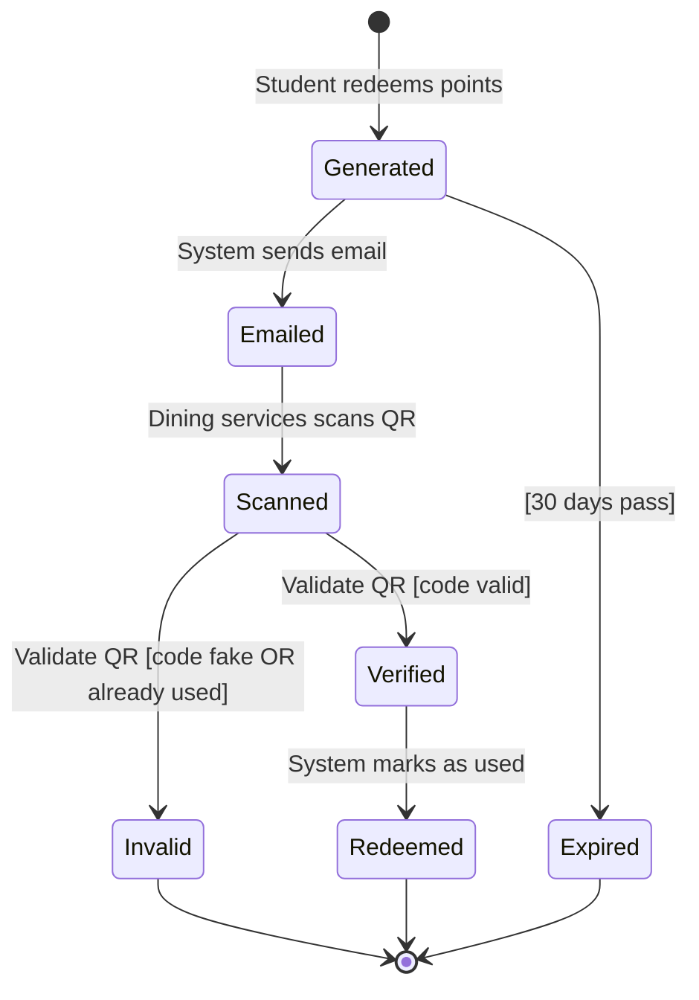
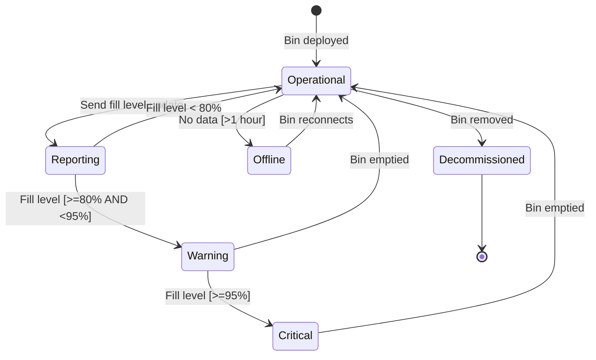
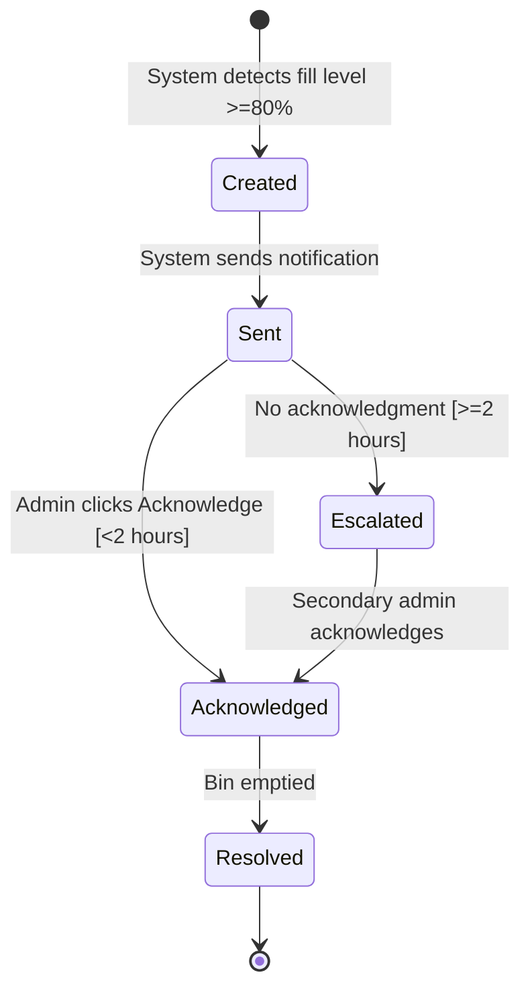
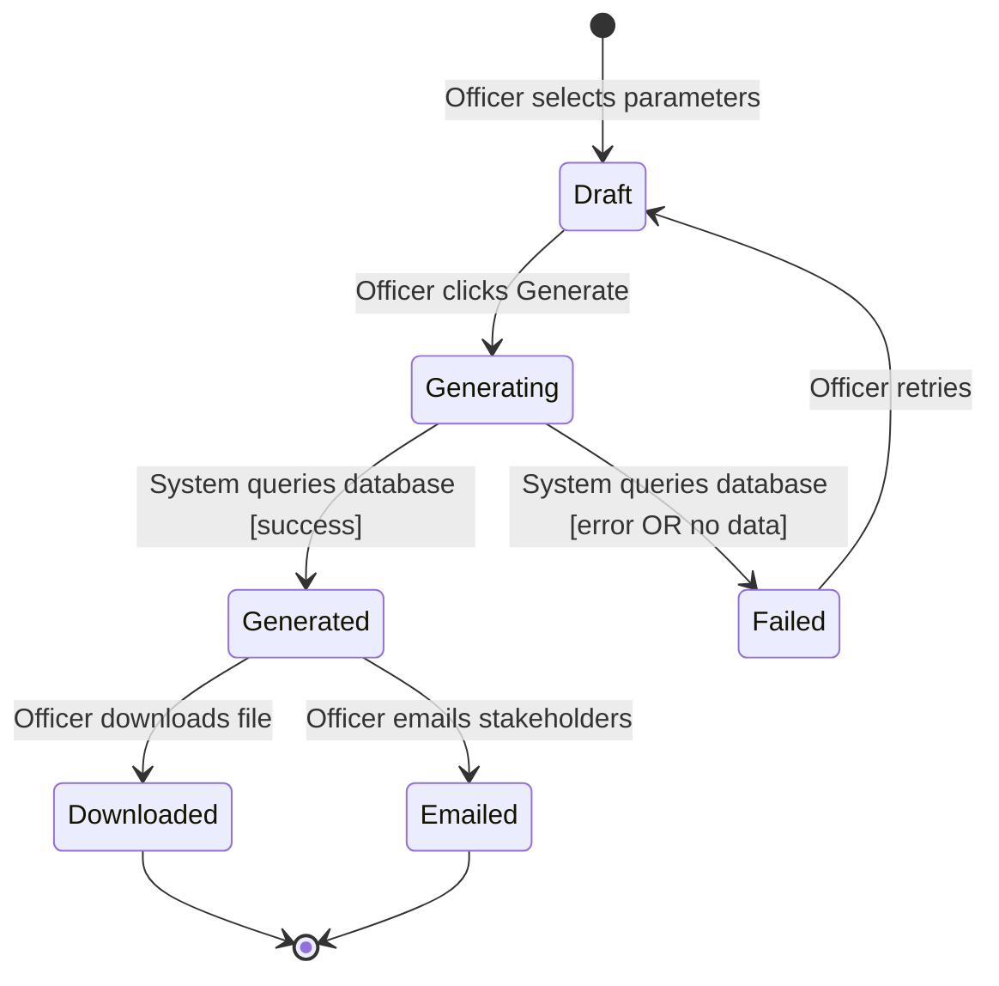
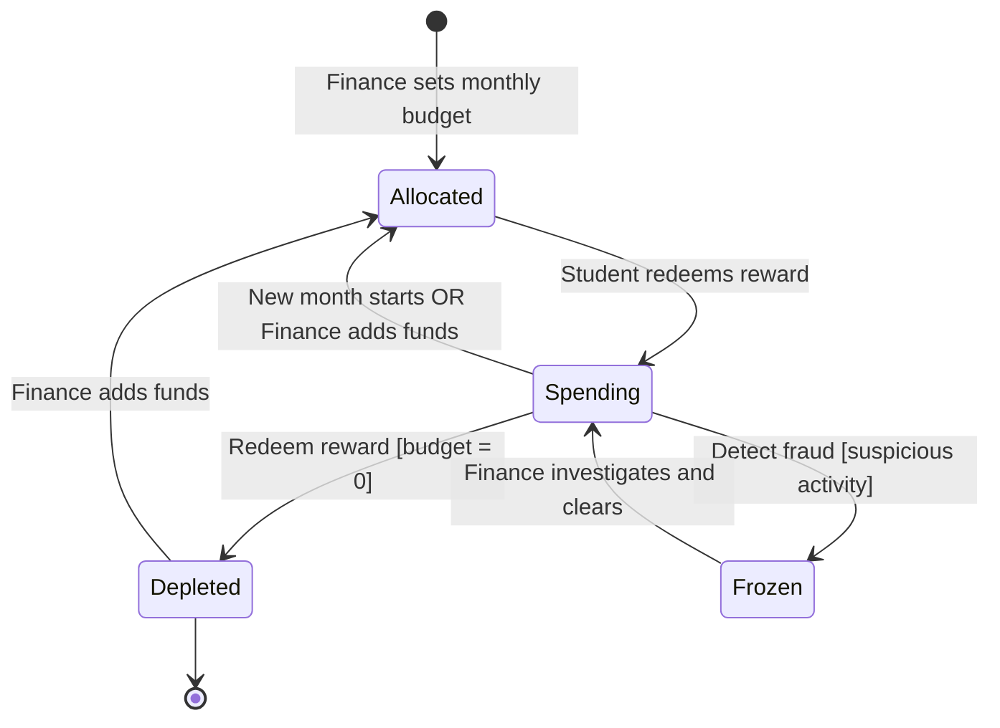

## Object 1: User Account

### Diagram

### Explanation

| Element | Description |
|---------|-------------|
| **States** | Registered, Verified, Active, Suspended, Deactivated |
| **Transitions** | Registration, email verification, login, suspension, account deletion |
| **Events** | Submit form, verify email, login attempt, admin action |
| **Guard Conditions** | Valid token required for verification; login only with correct credentials; suspension after ≥5 failed attempts |

### Traceability

**Functional Requirements:**
- FR1 (User Registration) → Registered state
- FR2 (User Authentication) → Active state
- FR2 (Security) → Suspended state

**User Stories:**
- US-001 (Register account) → Registered → Verified
- US-002 (Login) → Verified → Active

## Object 2: Recycling Transaction

### Diagram

### Explanation

| Element | Description |
|---------|-------------|
| **States** | Pending, Processing, Completed, Failed |
| **Transitions** | Scan bin, validate QR, award points, transaction failure |
| **Events** | User scans QR code, system validates, system awards points |
| **Guard Conditions** | Valid bin required for processing; item type valid and bin not full for completion |

### Traceability

**Functional Requirements:**
- FR3 (Point Awarding) → Completed state
- FR7 (Bin Fill-Level Monitoring) → Failed state when bin full

**User Stories:**
- US-003 (Deposit item and earn points) → Pending → Processing → Completed

## Object 3: Reward

### Diagram

### Explanation

| Element | Description |
|---------|-------------|
| **States** | Draft, Available, Limited, OutOfStock, Discontinued |
| **Transitions** | Create, publish, redeem, restock, discontinue |
| **Events** | Admin action, student redemption, inventory update |
| **Guard Conditions** | Inventory < 5 triggers Limited; inventory = 0 triggers OutOfStock |

### Traceability

**Functional Requirements:**
- FR5 (Reward Catalog) → Available state
- FR10 (Admin Reward Management) → Draft, Discontinued states

**User Stories:**
- US-006 (Browse available rewards) → Available, Limited states visible
- US-014 (Verify redemption vouchers) → Inventory decreases on redemption

## Object 4: Redemption Voucher

### Diagram

### Explanation

| Element | Description |
|---------|-------------|
| **States** | Generated, Emailed, Scanned, Verified, Invalid, Redeemed, Expired |
| **Transitions** | Redeem points, send email, scan QR, validate, mark used, expire |
| **Events** | Student redeems, system emails, dining services scans, system validates |
| **Guard Conditions** | Valid QR code triggers Verified; fake or used QR triggers Invalid; 30 days triggers Expired |

### Traceability

**Functional Requirements:**
- FR6 (Reward Redemption) → Generated, Emailed, Redeemed states
- FR14 (Verify Voucher) → Verified, Invalid states

**User Stories:**
- US-007 (Redeem points) → Generated → Emailed
- US-014 (Verify voucher) → Scanned → Verified/Invalid

## Object 5: SmartBin

### Diagram

### Explanation

| Element | Description |
|---------|-------------|
| **States** | Operational, Reporting, Warning, Critical, Offline, Decommissioned |
| **Transitions** | Deploy, send update, empty bin, lose connection, decommission |
| **Events** | Bin deployment, fill level sensor, staff empties bin, network timeout |
| **Guard Conditions** | Fill level ≥80% AND <95% triggers Warning; fill level ≥95% triggers Critical; no data for 1 hour triggers Offline |

### Traceability

**Functional Requirements:**
- FR7 (Bin Fill-Level Monitoring) → Reporting state
- FR8 (Fill-Level Alerts) → Warning and Critical states

**User Stories:**
- US-009 (Monitor bin fill levels) → Reporting → Warning → Critical
- US-010 (Receive alerts) → Alerts from Warning/Critical

## Object 6: Alert

### Diagram

### Explanation

| Element | Description |
|---------|-------------|
| **States** | Created, Sent, Acknowledged, Escalated, Resolved |
| **Transitions** | Detect fill level, send notification, acknowledge, escalate, resolve |
| **Events** | System detects threshold, system sends alert, admin acknowledges, staff empties bin |
| **Guard Conditions** | Acknowledgment within 2 hours prevents escalation; no acknowledgment for 2 hours triggers Escalated |

### Traceability

**Functional Requirements:**
- FR8 (Fill-Level Alerts) → Created, Sent, Escalated states
- FR7 (Bin Monitoring) → Resolved state

**User Stories:**
- US-010 (Receive alerts) → Created → Sent → Acknowledged/Escalated

## Object 7: Sustainability Report

### Diagram

### Explanation

| Element | Description |
|---------|-------------|
| **States** | Draft, Generating, Generated, Failed, Downloaded, Emailed |
| **Transitions** | Select parameters, generate, query database, download, email, retry |
| **Events** | Officer selects date range, system generates report, officer downloads or emails |
| **Guard Conditions** | Database error or no data triggers Failed; successful query triggers Generated |

### Traceability

**Functional Requirements:**
- FR9 (Recycling Analytics Dashboard) → Draft, Generating, Generated states
- FR9 (Generate Reports) → Downloaded, Emailed states

**User Stories:**
- US-011 (View analytics) → Data feeds into report
- US-012 (Generate reports) → Draft → Generating → Generated → Downloaded/Emailed

## Object 8: Reward Budget

### Diagram

### Explanation

| Element | Description |
|---------|-------------|
| **States** | Allocated, Spending, Depleted, Frozen |
| **Transitions** | Set budget, redeem reward, deplete funds, add funds, freeze, unfreeze |
| **Events** | Finance sets budget, student redeems, system detects fraud, finance investigates |
| **Guard Conditions** | Budget = 0 triggers Depleted; suspicious activity triggers Frozen |

### Traceability

**Functional Requirements:**
- FR13 (Manage reward budget) → Allocated, Spending, Depleted, Frozen states
- NFR-SEC1 (Security) → Frozen state for fraud detection

**User Stories:**
- US-013 (Manage budget) → Allocated → Spending → Depleted
- US-015 (Data encryption) → Security monitoring triggers Frozen
