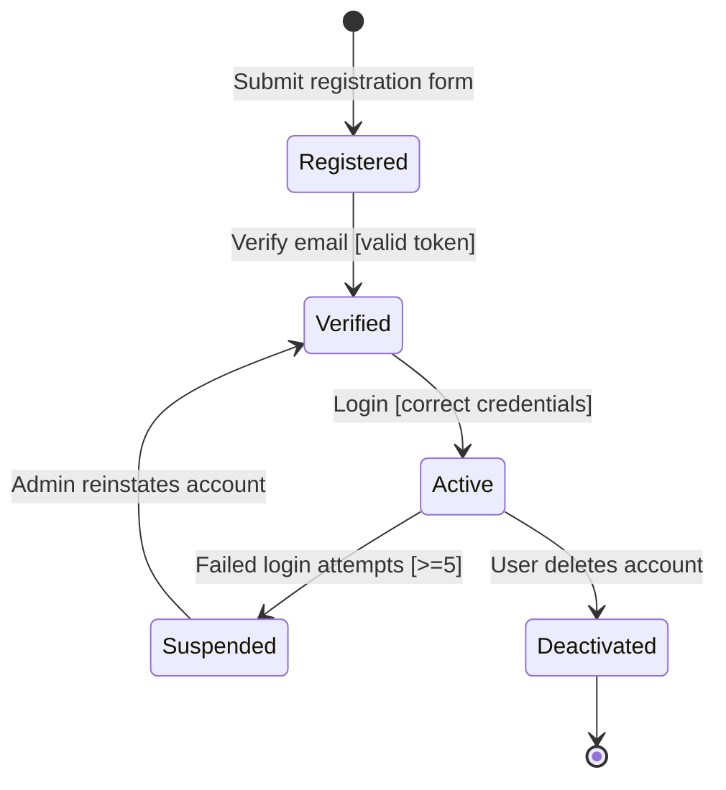
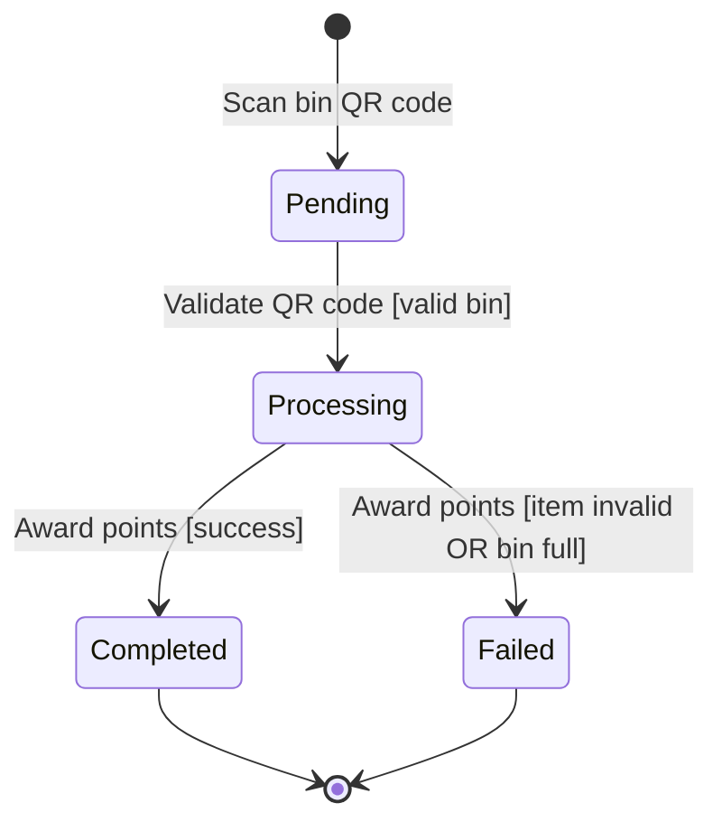

## Object 1: User Account

### Diagram

### Explanation

| Element | Description |
|---------|-------------|
| **States** | Registered, Verified, Active, Suspended, Deactivated |
| **Transitions** | Registration, email verification, login, suspension, account deletion |
| **Events** | Submit form, verify email, login attempt, admin action |
| **Guard Conditions** | Valid token required for verification; login only with correct credentials; suspension after ≥5 failed attempts |

### Traceability

**Functional Requirements:**
- FR1 (User Registration) → Registered state
- FR2 (User Authentication) → Active state
- FR2 (Security) → Suspended state

**User Stories:**
- US-001 (Register account) → Registered → Verified
- US-002 (Login) → Verified → Active

## Object 2: Recycling Transaction

### Diagram

### Explanation

| Element | Description |
|---------|-------------|
| **States** | Pending, Processing, Completed, Failed |
| **Transitions** | Scan bin, validate QR, award points, transaction failure |
| **Events** | User scans QR code, system validates, system awards points |
| **Guard Conditions** | Valid bin required for processing; item type valid and bin not full for completion |

### Traceability

**Functional Requirements:**
- FR3 (Point Awarding) → Completed state
- FR7 (Bin Fill-Level Monitoring) → Failed state when bin full

**User Stories:**
- US-003 (Deposit item and earn points) → Pending → Processing → Completed
